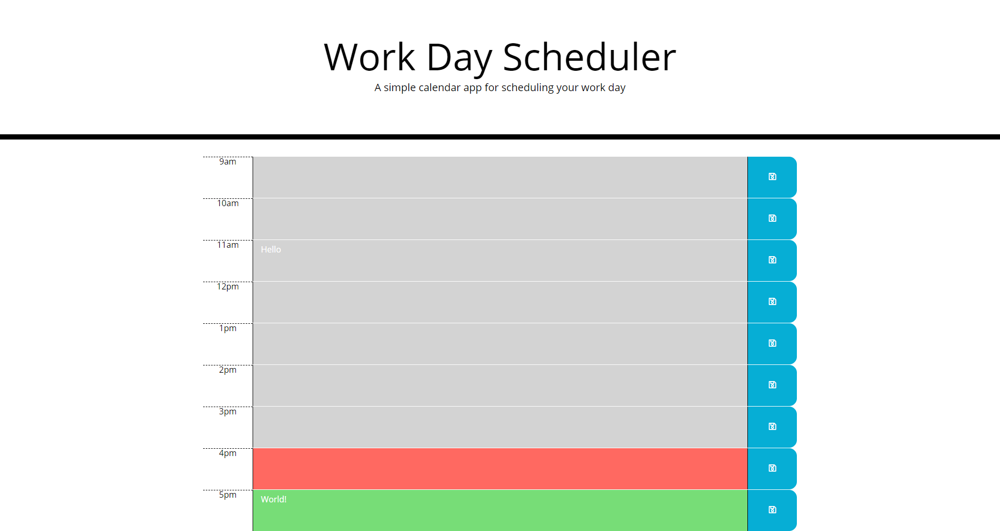

# Word-Day-Scheduler

## Description
I edited this code and created a Javascript file to make a day planner. I use a physical planner in day-to-day life, and having a planner on a screen could be very helpful. I use mine to help manage my time and to plan out my day accordingly. One good reason to use a digital planner is that you can easily see with colors what events have already passed and what to prepare for.

While having a dry code is important, sometimes it the most important thing is that the code works. I learned that the hard way in this project. If I had more time, I would've tried to make the code drier.

## Screenshot

## Link
<a href="https://aurorabrynn.github.io/word-day-scheduler/">Github Link</a>